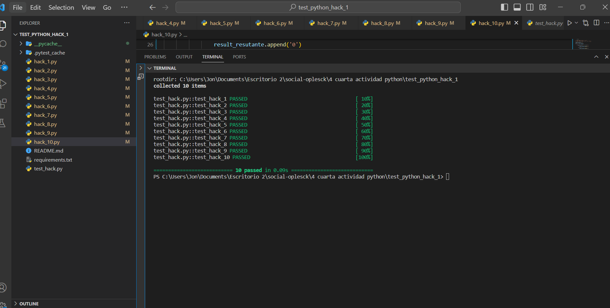

# Jon Apiscope
### 🏴‍☠️ HACKS 

```diff
* 1) Tienes que clonar el repositorio 
  git clone https://github.com/SocialOplesk/test_python_hack_1.git
  
* 2) Instalar los paquetes
  pip install -r requirements.txt

* 3) Para validar los hacks
  pytest test_hack.py -v (ejecuta todos los test)
  pytest test_hack.py::test_hack_1 (ejecuta un test en específico)
  pytest test_hack.py::test_hack_3 -v (ejecuta un test en específico)
```
<br/>

|Hacks | Details | 
|----------|---------|
| H-1      | "FOOZIMAN"|
| H-2      | "fooziman" |
| H-3      | "Fooziman" | 
| H-4      | "foozimaN" |
| H-5      | "f00z1m@n" |
| H-6      | [0,1,2,3,4,5] |
| H-7      | [5,4,3,2,1,0] | 
| H-8      | [3,5,7] |
| H-9      | [1,'@',2,'@',3,'@'] |
| H-10      | ["F","0","0","Z","1","M","@","N"] | 
<br/> 

## 🏆 Resultados

[Evidencia de test](https://github.com/jonvag/HACK4-python/blob/develop/Screenshot.png) 

